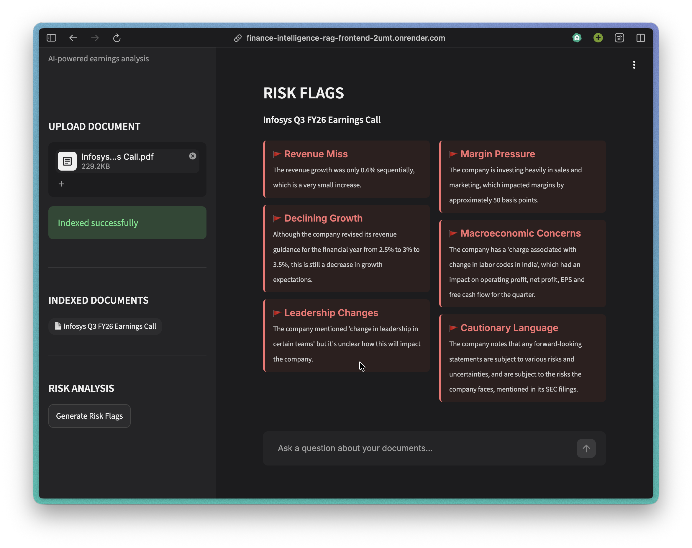
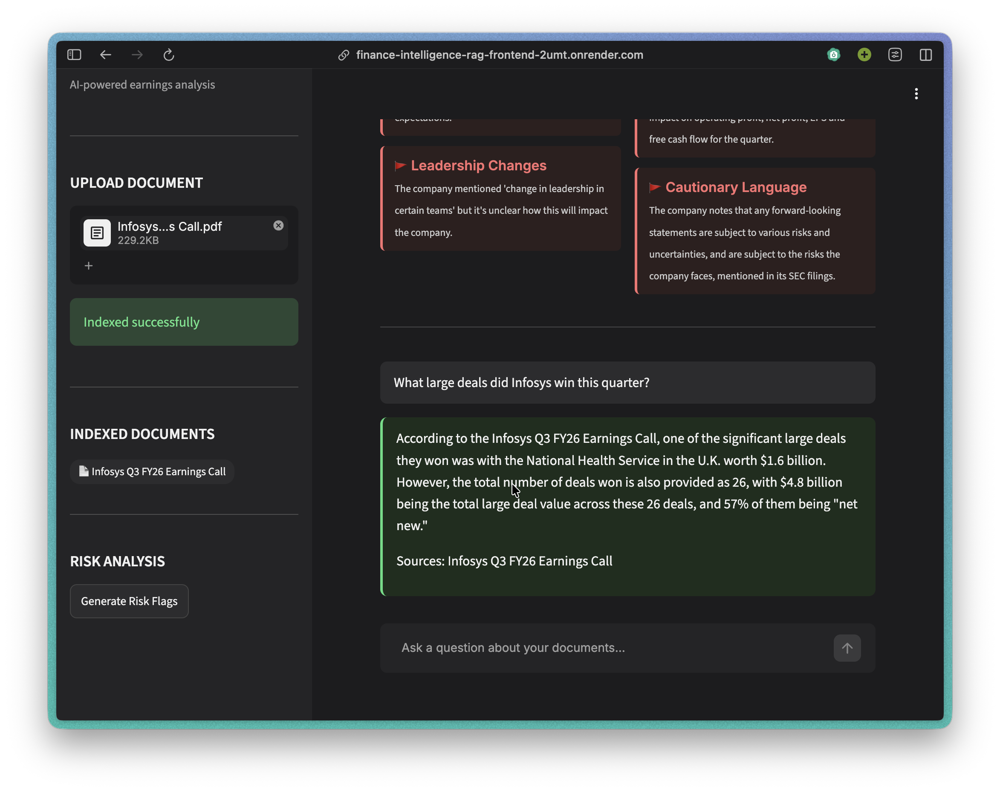

# Finance Intelligence Assistant

An AI-powered financial document analysis tool built as part of an EY internship project on **"Use of GenAI in the Finance Operations Value Chain"**. Upload earnings call transcripts and annual reports to query, compare, and identify risks across multiple companies using a Retrieval-Augmented Generation (RAG) pipeline.

## Demo




## Features

- **Multi-document QA** — Ask questions across multiple uploaded PDFs simultaneously
- **Cross-company comparison** — Compare financials, guidance, and metrics across companies
- **Automated risk flagging** — Detect red flags like revenue misses, margin pressure, and weak guidance
- **Chat interface** — Conversational UI with persistent chat history

## Tech Stack

- **Ingestion** — PyMuPDF for PDF text extraction and chunking
- **Embeddings** — [fastembed](https://github.com/qdrant/fastembed) (ONNX Runtime, `all-MiniLM-L6-v2`) — chosen over Sentence Transformers/PyTorch specifically to fit Render's 512MB free-tier memory limit
- **Vector Store** — Qdrant Cloud
- **LLM** — Groq API (LLaMA 3.1 8B)
- **Backend** — FastAPI, containerized with Docker
- **Frontend** — Streamlit

## Project Structure

```
backend/            FastAPI service
  main.py           API routes (/upload, /ask, /risks, /documents, /health)
  db.py             Qdrant client, collection setup, embedding model
  embed.py          PDF -> chunks -> embeddings -> Qdrant upsert
  rag.py            Retrieval, prompt injection checks, answer/risk generation
  ingest.py         PDF text extraction and chunking

frontend/
  app.py            Streamlit UI, talks to the backend over HTTP

eval/
  eval.py           Ragas evaluation (faithfulness, answer relevancy, context precision)
  requirements-eval.txt

tests/
  test_pipeline.py  Unit + integration tests (pytest)

Dockerfile           Builds the backend image
requirements-backend.txt   Backend-only deps (used by Docker)
requirements-frontend.txt  Frontend-only deps (used by the Render frontend service)
requirements.txt          Full dev environment (backend + frontend + tests)
.streamlit/config.toml    UI theme configuration
```

## Deployment

- **Frontend:** Deployed on Render (Streamlit), as a Python Web Service.
- **Backend:** Deployed on Render as a separate Web Service, built from the Dockerfile in this repo (Render's Runtime must be set to **Docker**, not Python, or it'll ignore the Dockerfile).
- **Vector store:** Qdrant Cloud (not self-hosted) — set `QDRANT_URL` and `QDRANT_API_KEY` on the backend service.

The frontend finds the backend via the `BACKEND_URL` environment variable (`frontend/app.py`), which must be set to the backend service's public Render URL. It defaults to `http://127.0.0.1:8000` for local development.

**Frontend Render service settings:**
- Build Command: `pip install -r requirements-frontend.txt` (not `requirements.txt` — that pulls in unused backend/test deps and slows the build considerably)
- Start Command: `streamlit run frontend/app.py --server.port $PORT --server.address 0.0.0.0 --server.enableCORS false --server.enableXsrfProtection false` (the CORS/XSRF flags are required behind Render's proxy, or the app loads blank with no visible error)
- Environment: `BACKEND_URL` = the backend service's public URL

**Required environment variables on the backend service:** `QDRANT_URL`, `QDRANT_API_KEY`, `GROQ_API_KEY`.

### Running locally

1. Start the backend (from the repo root, so `backend` resolves as a package):
   ```bash
   uvicorn backend.main:app --reload
   ```
2. Start the frontend:
   ```bash
   streamlit run frontend/app.py
   ```
3. Open `http://localhost:8501` in your browser.

### Running the backend via Docker locally

```bash
docker build -t finance-rag-backend .
docker run --rm -p 8000:8000 --env-file .env finance-rag-backend
```

## Setup

1. Clone the repo
2. Install dependencies:
   ```bash
   pip install -r requirements.txt
   ```
3. Create a `.env` file:
   ```
   GROQ_API_KEY=your_api_key_here
   QDRANT_URL=your_qdrant_cloud_url
   QDRANT_API_KEY=your_qdrant_api_key
   ```

## Security

- **Prompt injection detection** — Uploaded documents are scanned before indexing for patterns like "ignore previous instructions", "system prompt", "jailbreak", and "disregard"; matches raise a `ValueError` and abort indexing
- **Grounded generation** — The LLM prompt restricts answers to the retrieved context and instructs the model to say so when the answer isn't present, reducing hallucination and prompt leakage
- **Filename sanitization** — Uploaded filenames are stripped to their base name (`os.path.basename`) to prevent path traversal on write
- **File type validation** — Only `.pdf` uploads are accepted; all other file types are rejected
- **Rate limiting** — `/ask` and `/upload` are capped at 10 requests/minute per client via `slowapi` to guard against abuse
- **Source attribution** — Every generated answer is appended with the source document names for traceability and auditability
- **Secrets** — `.env` is gitignored and excluded from the Docker build context (`.dockerignore`); real credentials are injected at runtime (locally via `.env`, on Render via the dashboard's Environment tab), never baked into the image

## Testing

Run the test suite with:
```bash
pytest tests/
```

The tests cover:
- **Text extraction** — `extract_text_from_pdf` returns non-empty text from a sample PDF
- **Chunking** — `chunk_text` splits long text into multiple correctly-sized chunks
- **Prompt injection detection** — flagged text raises `ValueError`, clean financial text does not
- **Document listing** — `get_available_documents` returns a list
- **Full pipeline (integration)** — uploading and indexing a sample PDF followed by `generate_answer` returns a non-empty answer end to end

## Evaluation

`eval/eval.py` runs a small Ragas-based evaluation against a live backend (faithfulness, answer relevancy, context precision), including one deliberately out-of-scope question to check the system correctly refuses instead of hallucinating.

```bash
pip install -r eval/requirements-eval.txt
uvicorn backend.main:app &          # backend must be running
python eval/eval.py
```
