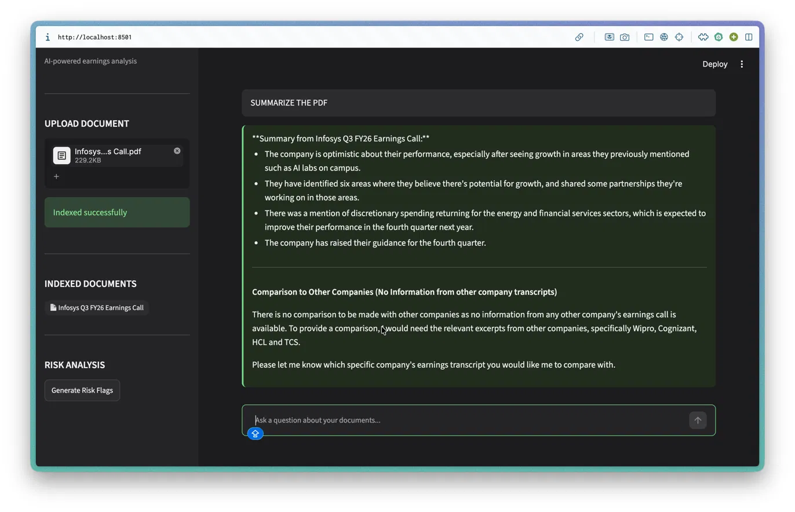
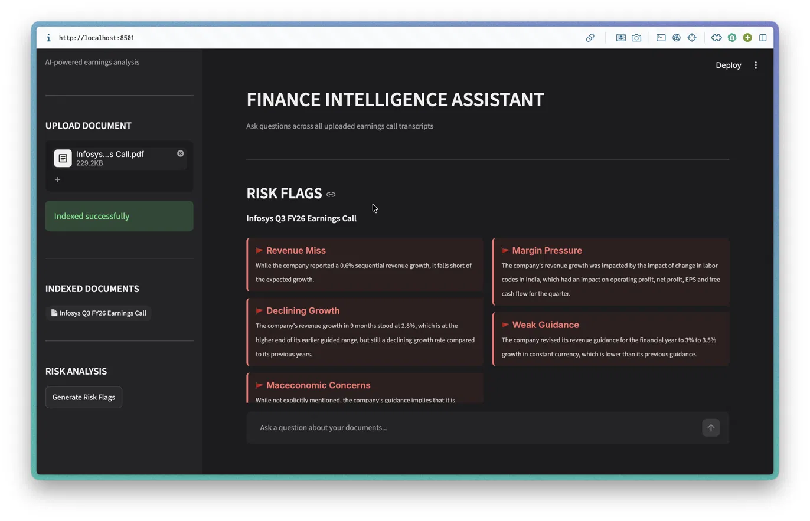

# Finance Intelligence Assistant

An AI-powered financial document analysis tool built as part of an EY internship project on **"Use of GenAI in the Finance Operations Value Chain"**. Upload earnings call transcripts and annual reports to query, compare, and identify risks across multiple companies using a Retrieval-Augmented Generation (RAG) pipeline.

## Demo




## Features

- **Multi-document QA** — Ask questions across multiple uploaded PDFs simultaneously
- **Cross-company comparison** — Compare financials, guidance, and metrics across companies
- **Automated risk flagging** — Detect red flags like revenue misses, margin pressure, and weak guidance
- **Chat interface** — Conversational UI with persistent chat history

## Tech Stack

- **Ingestion** — PyMuPDF for PDF text extraction and chunking
- **Embeddings** — Sentence Transformers (all-MiniLM-L6-v2)
- **Vector Store** — FAISS for semantic similarity search
- **LLM** — Groq API (LLaMA 3.1 8B)
- **Backend** — FastAPI
- **Frontend** — Streamlit

## Project Structure

- `ingest.py` — PDF extraction and chunking
- `embed.py` — Embedding generation and FAISS indexing
- `rag.py` — Retrieval and answer generation
- `main.py` — FastAPI backend
- `app.py` — Streamlit frontend
- `.streamlit/config.toml` — UI theme configuration

## Deployment

- **Frontend:** Deployed on Render at [https://finance-intelligence-rag-frontend.onrender.com](https://finance-intelligence-rag-frontend.onrender.com) — note this requires the backend running locally to function
- **Backend:** Runs locally due to memory constraints on free hosting tiers (Sentence Transformers requires ~400MB RAM, exceeding Render's 512MB free plan limit)

**To run the full app:**
1. Start the backend: `uvicorn main:app --reload`
2. Start the frontend: `streamlit run app.py`
3. Open `http://localhost:8501` in your browser

## Setup

1. Clone the repo
2. Install dependencies:
```bash
pip install -r requirements.txt
```
3. Create a `.env` file: